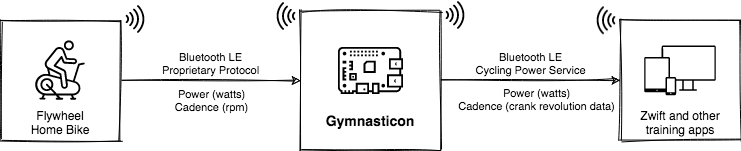

# Gymnasticon


Gymnasticon enables obsolete and proprietary exercise bikes to talk to Zwift and other training apps. You can extend it with additional bike profiles and broadcast protocols as needed.



## Thank you

This is an attempt to "upgrade" https://github.com/ptx2/gymnasticon. Many thanks to "PTX2" - whoever they are - if anyone knows who they are please let us know as they did some epic work several years ago with Gymnasticon. Their site is: https://ptx2.net/posts/unbricking-a-bike-with-a-raspberry-pi/

## Development Prerequisite: Node 14.21.3

The build and native dependencies target Node.js 14.21.3 so they remain compatible with Raspberry Pi Zero/Zero W units. The repository ships an `.nvmrc` with that version, and `npm install` now runs a guard (`scripts/check-node-version.cjs`) that aborts if you attempt to install with anything outside `>=14.21.3 <15`. Run `nvm use` (or install Node 14.21.3 manually) before installing packages; set `GYMNASTICON_ALLOW_UNSUPPORTED_NODE=1` only if you absolutely need to bypass the check.

## Choose Your Setup

Pick the path that matches how much control you need:

1. **Prebuilt Raspberry Pi image** (fastest): download and flash a ready-to-run SD/SSD image.
2. **Install script on Raspberry Pi OS**: run a one-line installer on an existing Pi.
3. **Manual install**: follow package-by-package steps on any Debian-like system.
4. **Build the image yourself**: generate a custom SD/SSD image under WSL or Linux.

Each option is detailed below. New users typically choose Option 1 or 2.

### Option 1 - Use the prebuilt Raspberry Pi image

The image is based on Raspberry Pi OS Buster and boots directly into Gymnasticon. Recommended for Raspberry Pi Zero/Zero W/Zero 2 W/3/4.

**Prerequisites**
- Raspberry Pi Zero W, Zero 2 W, Pi 3, or Pi 4 (Pi 5 requires Option 2).
- 4 GB or larger micro-SD (or SSD with a USB adapter).
- Computer with SD writer and flashing software (Raspberry Pi Imager, balenaEtcher, or `dd`).

**Steps**
1. Download `gymnasticon-raspberrypi.img.xz` from the [latest release](https://github.com/4o4R/gymnasticonV2/releases/latest).
2. (Recommended) Verify the checksum from the release assets:
   ```bash
   sha256sum gymnasticon-raspberrypi.img.xz
   ```
3. Flash the archive with Raspberry Pi Imager (Use custom -> select the `.img.xz`) or `dd`.
4. Optional: copy `gymnasticon-wifi.env.example` from the boot partition to `gymnasticon-wifi.env`, fill in `WIFI_COUNTRY`, `WIFI_SSID`, and `WIFI_PSK`, and the image will automatically unblock Wi-Fi and join your network on first boot—no HDMI, keyboard, or raspi-config required.
5. Optional: copy a `gymnasticon.json` config into the boot partition to pre-set your bike profile.
6. Insert the card in the Pi and power it on. First boot takes about 2-3 minutes.
7. Log in if needed (default credentials `pi` / `raspberry`) or just start pedaling and pair Zwift with the `Gymnasticon` power and cadence sensors.

**Verify**
```bash
sudo systemctl status gymnasticon
journalctl -u gymnasticon -f
```

### Option 2 - Install onto Raspberry Pi OS using the script

Use this when you already have Raspberry Pi OS on the device, or when you want Raspberry Pi OS Bookworm support for Pi 5.

**Prerequisites**
- Raspberry Pi OS Buster Lite (Zero/Zero W/Zero 2 W/3/4) or Bookworm Lite (Pi 5).
- SSH access and internet connectivity on the Pi.

**Steps**
1. Boot Raspberry Pi OS and connect it to the network.
2. SSH into the Pi and run the installer:
   ```bash
   curl -sSL https://raw.githubusercontent.com/4o4R/gymnasticonV2/main/deploy/install.sh | bash
   ```
   This script removes any previous install, installs system packages, pulls Node.js 14.21.3 (ARMv6 build on Pi Zero family), clones Gymnasticon into `/opt/gymnasticon`, runs `npm install --omit=dev`, and enables the `gymnasticon` systemd service.
   It automatically detects whether you are on Raspberry Pi OS Legacy (Buster) or newer releases (Bullseye/Bookworm), rewrites apt mirrors when necessary, and installs optional packages only when they exist—no codename knowledge required.
3. Reinstalling remotely? Use nohup to watch progress later:
   ```bash
   sudo rm -rf /opt/gymnasticon && nohup bash -c "curl -sSL https://raw.githubusercontent.com/4o4R/gymnasticonV2/main/deploy/install.sh | bash" > install.log 2>&1 &
   tail -f install.log
   ```
4. Confirm the service is running and tail logs as needed:
   ```bash
   sudo systemctl status gymnasticon
   journalctl -u gymnasticon -f
   ```
5. Edit `/opt/gymnasticon/gymnasticon.json` for bike-specific settings and restart the service if you make changes:
   ```bash
   sudo nano /opt/gymnasticon/gymnasticon.json
   sudo systemctl restart gymnasticon
   ```

### Option 3 - Manual install (advanced)

Manual setup is useful for non-Raspberry Pi Linux hosts, development workstations, or when you need to audit each dependency.

**Requirements**
1. Node.js 14.x (14.21.3 recommended for broad compatibility).
   - Pi Zero / Zero W (ARMv6): download `node-v14.21.3-linux-armv6l.tar.xz` from the [unofficial Node.js archive](https://unofficial-builds.nodejs.org/download/release/v14.21.3/) and extract into `/usr/local`.
   - Pi 3/4/5 or x86_64/arm64: install Node.js 14.x from your package manager (NodeSource `setup_14.x`, Homebrew, etc.).
2. System packages (Debian-based example):
   ```bash
   sudo apt-get install -y bluetooth bluez libbluetooth-dev libudev-dev libusb-1.0-0-dev build-essential python3 pkg-config git curl ca-certificates
   # Optional but recommended on Bullseye/Bookworm where available:
   sudo apt-cache show python-is-python3 >/dev/null 2>&1 && sudo apt-get install -y python-is-python3
   ```
3. BLE-capable Bluetooth adapter (LE multi-role recommended) and optional ANT+ USB stick.

**Install steps**
```bash
# Clone the repo
sudo git clone https://github.com/4o4R/gymnasticonV2.git /opt/gymnasticon
cd /opt/gymnasticon

# ARMv6 boards need this before npm install
export CXXFLAGS=-std=gnu++14

# Production install
sudo npm install --omit=dev

# Allow Node to open raw BLE sockets without sudo
sudo setcap cap_net_raw+eip "$(command -v node)"

# Optional: register the systemd service
sudo cp deploy/gymnasticon.service /etc/systemd/system/
sudo systemctl daemon-reload
sudo systemctl enable --now gymnasticon
```

For development builds, add dev dependencies with `npm install --include=dev` instead, and run the CLI directly from the repository (`node src/app/cli.js`).

### Option 4 - Build the image yourself

Need a customized Raspberry Pi image or want to publish a new release? Follow the step-by-step WSL/Linux guide in [`docs/build-sd-image.md`](docs/build-sd-image.md). The helper script (`scripts/build-pi-image.sh`) downloads Raspberry Pi's `pi-gen`, applies Gymnasticon's stages, and emits images in `deploy/pi-sdcard/pi-gen/deploy/`.

## After installation

- Gymnasticon starts automatically as the `gymnasticon` systemd service.
- Check metrics or troubleshoot with `journalctl -u gymnasticon -f`.
- Update to a new release by re-running the installer script or flashing the latest image.

## Bikes tested

- Flywheel
- Peloton Bike (requires an [additional cable](https://github.com/ptx2/gymnasticon/pull/12#issuecomment-696345309))
- Schwinn IC4/IC8 aka Bowflex C6 (power estimation when necessary)
- Schwinn 290 recumbent (auto-detected via the IC4 FTMS profile)
- Keiser M Series Bikes (M3i, M3i-TBT, M3iX)
- LifeFitness IC5 (power estimation)

> **Why "power estimation" for IC8/C6?** The IC8/Bowflex C6 consoles only expose cadence
> and resistance hints over Bluetooth. They do *not* broadcast the standard FTMS power
> characteristic, so Gymnasticon derives wattage from those two signals via a calibrated
> curve (`src/bikes/ic8.js`). If your bike starts emitting native FTMS power in a future
> firmware update you can flip to the IC4 profile to consume that directly, but as of
> now every IC8/C6 report we have seen requires this calculated wattage.

### Schwinn 290 Recumbent

Gymnasticon now treats the Schwinn 290 console exactly like an IC4 because both broadcast
the standard FTMS Indoor Bike Data flow (Service `0x1826`, Characteristic `0x2AD2`, Control
Point `0x2AD9`). The only difference is the advertised name (`IC Bike`, `Schwinn 290 Bike`,
or `FTMS-Bike`). Autodetect and `--bike ic4` now match all of those variants, so no extra
configuration is needed—just power on the bike and let Gymnasticon connect.

## Apps and devices tested

Any software, bike computer, or watch that supports standard Bluetooth LE and ANT+ power meter/cadence sensors should work, including:

- Zwift
- TrainerRoad
- Rouvy
- RGT
- FulGaz
- mPaceline
- Peloton iOS/Android (BLE CSC cadence only)
- Garmin Fenix (requires ANT+ stick)
- Garmin Edge
- Wahoo Elemnt Bolt (requires ANT+ stick)

### Apple Watch heart-rate bridge

Gymnasticon listens for the standard Bluetooth Low Energy Heart Rate Service (UUIDs `0x180D/0x2A37`). Apple Watch does **not** broadcast that profile by itself, so you will not see heart-rate data unless the watch data is relayed through an app that re-advertises it over BLE.

**Quick setup**

1. Install a bridge app on the paired iPhone—free options that only request HealthKit permission include:
   - [HeartCast](https://apps.apple.com/us/app/heartcast/id1476940466)
   - [BlueHeart](https://apps.apple.com/us/app/blueheart-ble-heart-rate/id1548265110)
   - [Echo Heart Rate](https://apps.apple.com/us/app/echo-heart-rate/id1548266440)
2. Launch the companion watch app if prompted, start a broadcast, and keep the iPhone near the Raspberry Pi so the BLE advertisement stays in range.
3. Power on your bike; Gymnasticon will auto-detect the new heart-rate peripheral and rebroadcast it to Zwift/TrainerRoad along with power/cadence/speed.

> **Why not watch-only?** watchOS does not allow third-party apps to act as always-on BLE heart-rate peripherals without an iPhone relay, so there is currently no way for the Pi to read Apple Watch data directly. If Apple relaxes that policy in the future, Gymnasticon will pick it up automatically as soon as the watch advertises a standard Heart Rate Service.

## Platforms tested

**Raspberry Pi Zero 2 W is the recommended target for best performance.** The prebuilt image targets Pi Zero/Zero W/Zero 2 W/3/4 and ships on Raspberry Pi OS Buster. For Raspberry Pi 5 devices, install Raspberry Pi OS Bookworm and use Option 2 or build a Bookworm-based image with Option 4.

- Raspberry Pi OS Buster on Raspberry Pi Zero W
- Raspberry Pi OS Buster on Raspberry Pi 3B+
- Raspberry Pi OS Buster on Raspberry Pi 4
- Raspberry Pi OS Bookworm on Raspberry Pi 5 (manual install)
- macOS 10.14+
- Debian Buster/Bookworm on x86-64

> Note: Bluetooth LE bikes require an adapter with multi-role capability. Raspberry Pi boards listed above include a compatible adapter. Dual-adapter setups (one for scanning, one for advertising) are also supported.

## Troubleshooting and further reading

- [Troubleshooting guide](docs/troubleshooting.md)
- [Windows development setup](docs/windows-dev-setup.md)
- [Learning guide](docs/learning-guide.md)
- [Build the SD image](docs/build-sd-image.md)
