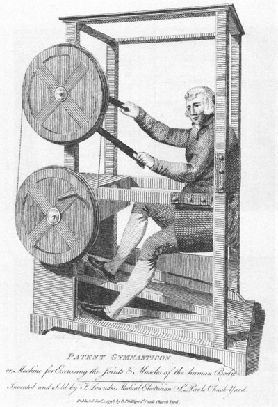
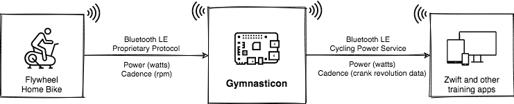

# Gymnasticon



Gymnasticon turns supported indoor bikes into standards-based cycling sensors. It connects to the bike console, normalizes power/cadence/speed data, and rebroadcasts the ride over Bluetooth LE and ANT+ so training apps and bike computers can pair with the bike as if it were a native power meter.



## Highlights

- Runs headlessly on Raspberry Pi hardware.
- Supports Bluetooth LE bike profiles, Peloton serial data, and Keiser broadcast data.
- Broadcasts standard Bluetooth Cycling Power and Cycling Speed/Cadence services.
- Optionally broadcasts ANT+ Bicycle Power with a compatible USB ANT+ stick.
- Includes Raspberry Pi images, a one-line installer, and manual Linux install instructions.
- Supports dual Bluetooth adapters for more reliable scanning, advertising, and heart-rate rebroadcast.

Gymnasticon is not affiliated with Zwift, Peloton, Garmin, Wahoo, Apple, or the bike manufacturers listed here.

## Quick Start

Choose the install path that matches your hardware.

| Hardware | Recommended path | Notes |
| --- | --- | --- |
| Raspberry Pi Zero 2 W, Pi 3, Pi 4, Pi 400, CM | Modern image or installer | Uses Raspberry Pi OS Bookworm. |
| Raspberry Pi Zero / Zero W | Legacy image | Bring a USB Bluetooth LE dongle. |
| Raspberry Pi 5 | Installer | Use Raspberry Pi OS Bookworm. |
| Development workstation | Manual install | Useful for local testing and bot mode. |

### Option 1: Flash a Raspberry Pi image

Use this path for the fastest appliance-style setup.

1. Download the right image from the [latest release](https://github.com/4o4R/gymnasticonV2/releases/latest):
   - Modern: `Gymnasticon-modern-*.img.xz`
   - Legacy: `Gymnasticon-legacy-*.img.xz`
2. Verify the checksum from the release assets:
   ```bash
   sha256sum Gymnasticon-*-*.img.xz
   ```
3. Flash the `.img.xz` with Raspberry Pi Imager, balenaEtcher, or `dd`.
4. Open the FAT partition named `bootfs` (the only partition macOS normally shows). Copy `gymnasticon-wifi.env.example` to `gymnasticon-wifi.env`, then set `WIFI_COUNTRY`, `WIFI_SSID`, and `WIFI_PSK`.
5. Optional: copy `gymnasticon.json` to the top level of `bootfs` to override the default bike profile.
6. Boot the Pi, power on the bike, and pair your app with `GymnasticonV2`.

Check the service:

```bash
sudo systemctl status gymnasticon
journalctl -u gymnasticon -f
```

### Option 2: Install on Raspberry Pi OS

Use this path when you already have Raspberry Pi OS installed or when you are targeting Pi 5.

```bash
curl -sSL https://raw.githubusercontent.com/4o4R/gymnasticonV2/main/deploy/install.sh | bash
```

The installer pins Node.js 14.21.3, installs the native build dependencies, copies the default configuration to `/etc/gymnasticon.json`, and enables the `gymnasticon` systemd service.

After installation:

```bash
sudo systemctl status gymnasticon
journalctl -u gymnasticon -f
sudo nano /etc/gymnasticon.json
sudo systemctl restart gymnasticon
```

### Option 3: Manual Linux install

Manual installation is intended for development machines, non-Pi Linux hosts, or users who need to audit each dependency.

Requirements:

- Node.js 14.21.3. The native Bluetooth and serial stack is pinned to Node 14 for Raspberry Pi Zero compatibility.
- Debian packages for Bluetooth, USB, build tools, Python 3, and `pkg-config`.
- A Bluetooth LE adapter with multi-role support. ANT+ output also requires a compatible USB ANT+ stick.

Install:

```bash
sudo apt-get install -y bluetooth bluez libbluetooth-dev libudev-dev libusb-1.0-0-dev build-essential python3 pkg-config git curl ca-certificates

sudo git clone https://github.com/4o4R/gymnasticonV2.git /opt/gymnasticon
cd /opt/gymnasticon

NODE_GYP_BIN="$(npm root -g)/node-gyp/bin/node-gyp.js"
export npm_config_node_gyp="$NODE_GYP_BIN"
export npm_config_python=/usr/bin/python3
export CXXFLAGS=-std=gnu++14

sudo env npm_config_node_gyp="$NODE_GYP_BIN" npm_config_python=/usr/bin/python3 CXXFLAGS=-std=gnu++14 npm install --omit=dev
sudo setcap cap_net_raw+eip "$(command -v node)"

sudo cp deploy/gymnasticon.service /etc/systemd/system/
sudo systemctl daemon-reload
sudo systemctl enable --now gymnasticon
```

### Option 4: Build a custom image

For release work or customized Raspberry Pi images, use the WSL/Linux image build guide:

- [Build the SD image](docs/build-sd-image.md)

## Configuration

Installed systems read `/etc/gymnasticon.json`. Image-based installs can also accept a `gymnasticon.json` file placed at the top level of the macOS-visible `bootfs` partition before first boot. On the running Pi, that same partition is mounted at `/boot/firmware` on Bookworm or `/boot` on Buster.

Default configuration:

```json
{
  "bike": "autodetect",
  "defaultBike": "keiser",
  "serverName": "GymnasticonV2",
  "bikeReceiveTimeout": 10,
  "powerScale": 1,
  "powerOffset": 0
}
```

Common options:

| Option | Purpose |
| --- | --- |
| `bike` | Select a fixed profile such as `flywheel`, `peloton`, `ic4`, `ic5`, `ic8`, `keiser`, `bot`, or `autodetect`. |
| `defaultBike` | Fallback profile when autodetect does not find a supported bike. |
| `serverName` | Bluetooth advertisement name shown to training apps. |
| `bikeAdapter` | Bluetooth adapter used to connect to the bike, for example `hci0`. |
| `serverAdapter` / `serverAdapters` | Bluetooth adapter or adapters used to advertise Gymnasticon. |
| `bleMultiOutput` | Mirror BLE output across multiple adapters when available. |
| `antAuto` / `antEnabled` | Automatically or explicitly enable ANT+ output. |
| `powerScale` / `powerOffset` | Calibrate reported wattage. |
| `heartRateEnabled` / `heartRateAdapter` | Control heart-rate rebroadcast behavior. |

Most users can leave the defaults in place and rely on autodetection.

## Supported Bikes

| Bike | Input | Notes |
| --- | --- | --- |
| Flywheel | Bluetooth LE | Reads bike power and cadence. |
| Peloton Bike | USB serial | Requires the active cable setup documented by the original Gymnasticon project. |
| Schwinn IC4 / IC8 / Bowflex C6 | Bluetooth LE | IC8/C6 power is estimated from cadence and resistance when native power is unavailable. |
| Schwinn 290 recumbent | Bluetooth LE FTMS | Auto-detected through the IC4-compatible FTMS profile. |
| Keiser M Series (M3i, M3i-TBT, M3iX) | Bluetooth broadcast | Can be filtered by MAC address if needed. |
| LifeFitness IC5 | Bluetooth LE | Uses the FTMS profile with power estimation where needed. |

## Supported Outputs

Gymnasticon presents the bike as standard fitness sensors:

- Bluetooth LE Cycling Power Service
- Bluetooth LE Cycling Speed and Cadence Service
- Optional ANT+ Bicycle Power profile
- Optional heart-rate rebroadcast from a standard BLE Heart Rate Service peripheral

Compatible apps and devices include Zwift, TrainerRoad, Rouvy, FulGaz, mPaceline, Garmin watches and bike computers, Wahoo ELEMNT devices, and other clients that support standard BLE or ANT+ cycling sensors.

## Apple Watch Heart Rate

Apple Watch does not advertise the standard BLE Heart Rate Service directly. To include Apple Watch heart rate in Gymnasticon output, use an iPhone bridge app that re-advertises watch heart rate over BLE, then keep the iPhone near the Raspberry Pi.

Known bridge options include:

- HeartCast
- BlueHeart
- Echo Heart Rate

Once the bridge is advertising, Gymnasticon can detect the standard heart-rate peripheral and forward the value alongside bike metrics.

## Bluetooth and ANT+ Behavior

Gymnasticon detects available Bluetooth adapters and assigns radio roles automatically:

- The bike adapter scans for and connects to the bike.
- The server adapter advertises Gymnasticon to training apps.
- Dual-adapter Pi Zero setups prefer the onboard adapter for bike scanning and a USB BLE dongle for advertising.
- Multi-output mode can mirror BLE advertising across multiple suitable adapters.
- ANT+ uses a separate USB ANT+ stick and does not consume a Bluetooth adapter.

On single-adapter Pi Zero / Zero W systems, power/cadence/speed output still works, but heart-rate rebroadcast is disabled by default to avoid unstable scan/advertise switching.

## Development

This project intentionally targets Node.js 14.21.3 because Raspberry Pi Zero / Zero W support depends on ARMv6-compatible native modules. The repository includes an `.nvmrc`, and `npm install` rejects unsupported Node versions unless `GYMNASTICON_ALLOW_UNSUPPORTED_NODE=1` is set.

```bash
nvm use
npm install
npm test
node node_modules/eslint/bin/eslint.js . --ignore-pattern node_modules --ignore-pattern deploy/pi-sdcard/pi-gen
```

For local simulation without bike hardware:

```bash
npm run dev
```

## Documentation

- [Troubleshooting](docs/troubleshooting.md)
- [Windows development setup](docs/windows-dev-setup.md)
- [Build a Raspberry Pi image](docs/build-sd-image.md)

## Project Lineage

Gymnasticon V2 builds on the original [ptx2/gymnasticon](https://github.com/ptx2/gymnasticon) project and the research documented at [ptx2.net](https://ptx2.net/posts/unbricking-a-bike-with-a-raspberry-pi/). This fork focuses on modern Raspberry Pi images, more robust Bluetooth adapter handling, additional bike profiles, and a cleaner install path.
